# Income/Expense tracker

React Native app created with Expo to track daily incomes, expenses in a structured way. The app makes it possible to group your transactions by accounts, user-created groups (like friends, family, etc.) and categories. Various types of charts are helping to visualize your financial data.

## Installation

To install the app, follow these steps:

1. Download the APK file from here: [APK Download](https://github.com/istvankurucz/expense-tracker/releases/tag/v0.1.0-alpha)
2. Install the APK on your Android device.
3. Open the app and start tracking your income and expenses!

## Features

-  Data stored in a local database (no internet connection required)
-  Grouping transactions by accounts, user-created groups, and categories (all of these can be customized)
-  Various types of charts to visualize your data on daily, weekly, monthly, and yearly basis
-  Filtering and sorting options for transactions
-  Light and dark mode

## Screenshots

Create account and home screens:

  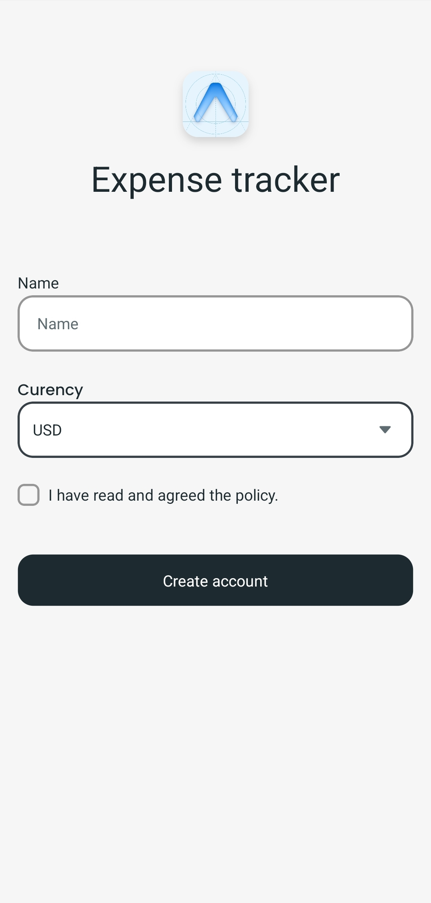
  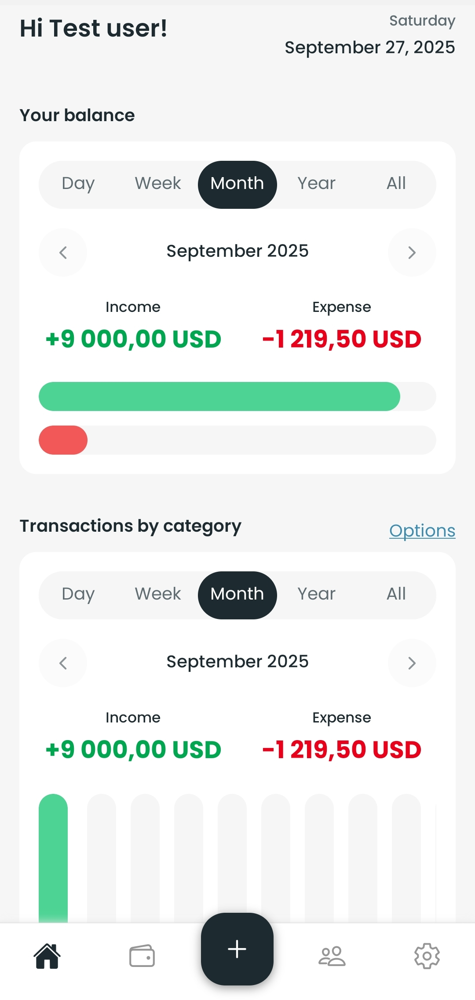

Account screens:

  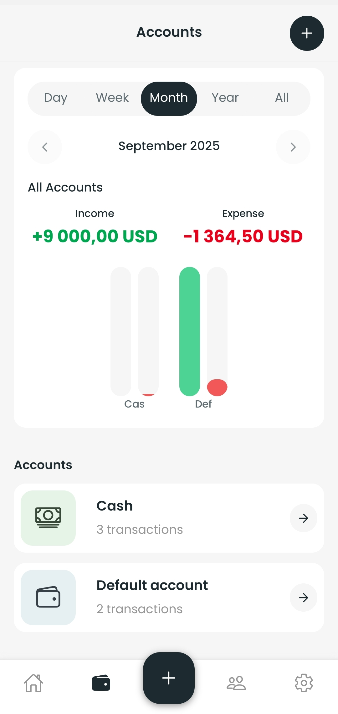
  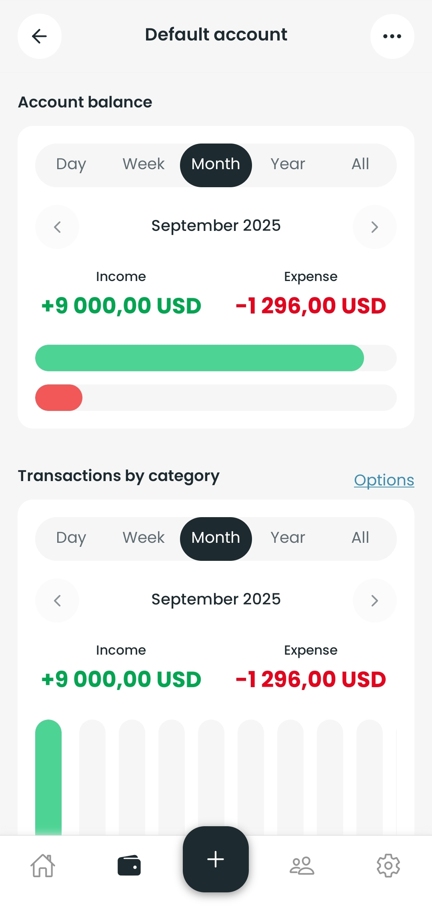
  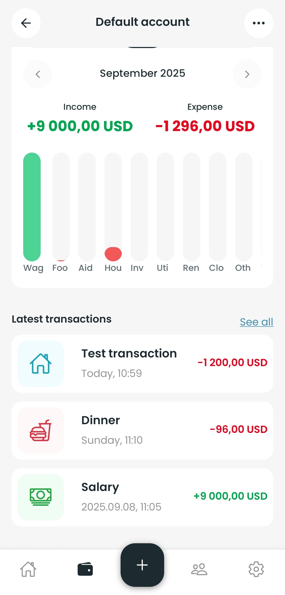

Group screens:

  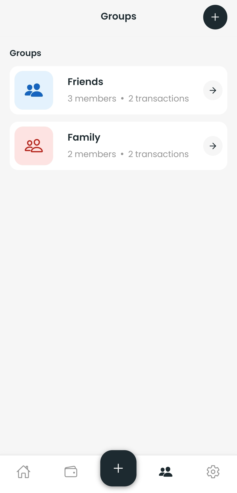
  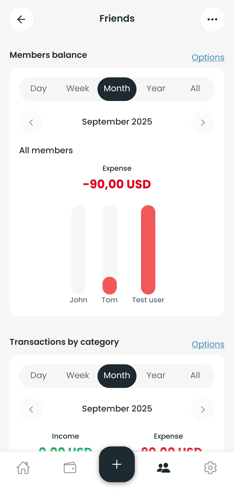
  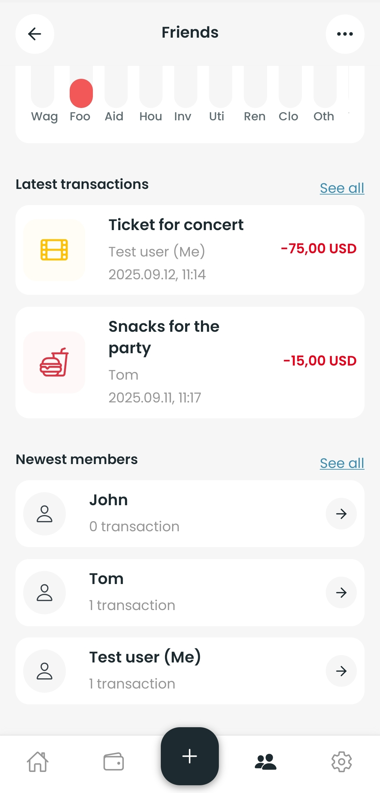

New transaction and categories screens:

  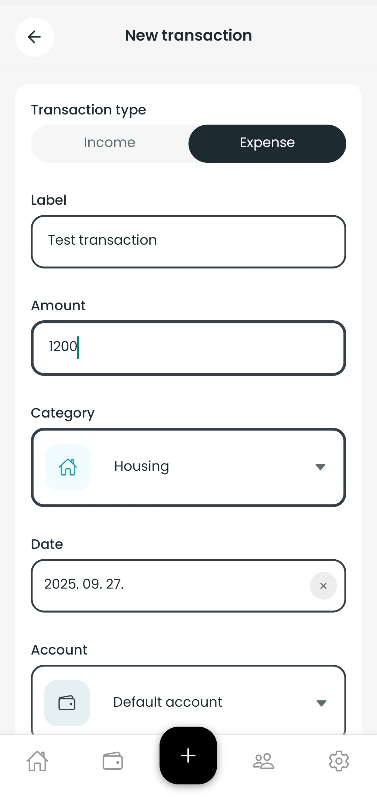
  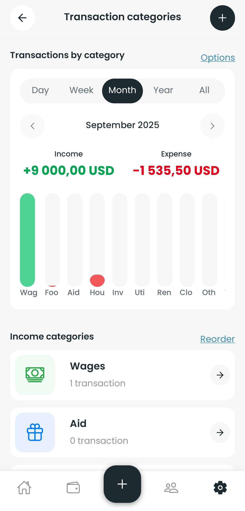
  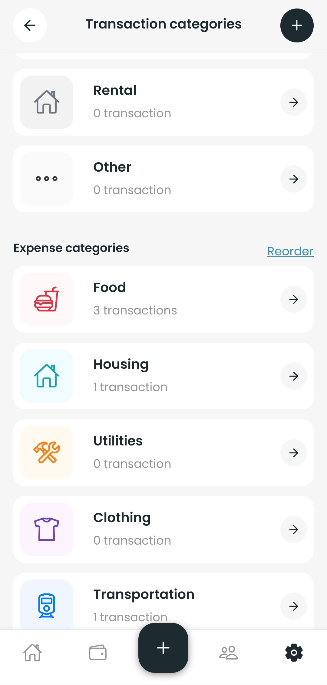

## Technologies Used

This app was developed using the following technologies:

-  **Expo React Native**: The framework for building cross-platform mobile applications. It provides a set of tools and services to streamline the development process.
-  **TypeScript**: To add type safety and improve code maintainability.
-  **Expo SQLite**: For local data storage and management.
-  **Drizzle ORM**: For type-safe database interactions.
-  **React Query**: For data fetching and state management.
-  **Context API**: For managing in-app state.
-  **ESLint & Prettier**: For code quality and formatting.

## Contact and support

If you have any questions, suggestions or found a bug, feel free to reach out to me via email: [kurucz.isti63@gmail.com](mailto:kurucz.isti63@gmail.com?subject=Expense%20Tracker%20App%20Support).

Every feedback is well appreciated!
